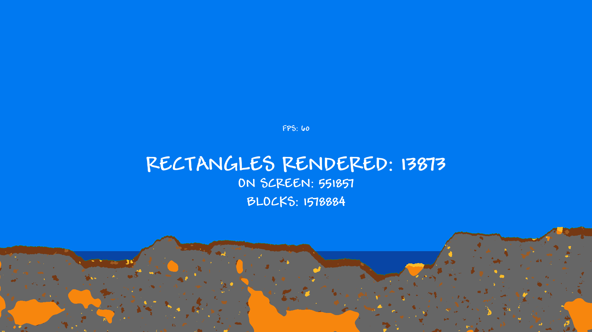

# Terraria Clone
Terraria Clone will be a 2D survival game heavily based off of Terraria. Fight off monsters, build a base and explore. The name is a work in progress and will be changed later in development.



## Table of Contents
- [Features](#features)
- [Installation](#installation)
- [Usage](#usage)
- [Contributing](#contributing)
- [License](#license)

## Features
No features as of now.

## Installation

#### Prerequisites
You must have git, cmake, a C++ compiler, raylib and nlohmann-json installed.

#### Installation
1. Clone the repository:
```bash
git clone https://github.com/Acerx-AMJ/Terraria-Clone.git
```
2. Navigate in the repository:
```bash
cd Terraria-Clone
```
3. Build using CMake:
```bash
cmake -B build
cmake --build build
```
The executable will be found in `build/terraria`. If something didn't work, feel free to open an issue.

## Usage

Simply run the executable after [building](#installation). Assets folder must be in the same directory in which the executable is ran.

## Contributing

Feel free to fork, create PRs or issues.
1. Fork the repository.
2. Create a new branch (don't use the braces):
```bash
git checkout -b [feature-name]
```
3. Make your changes.
4. Commit and push your changes:
```bash
git add . # Or, alternatively, select specific files to add
git commit -m "[commit-message]"
git push origin [feature-name]
```
5. Create a pull request.

## License

This project is licensed under the [MIT License](LICENSE). Feel free to copy, edit and distribute the code.