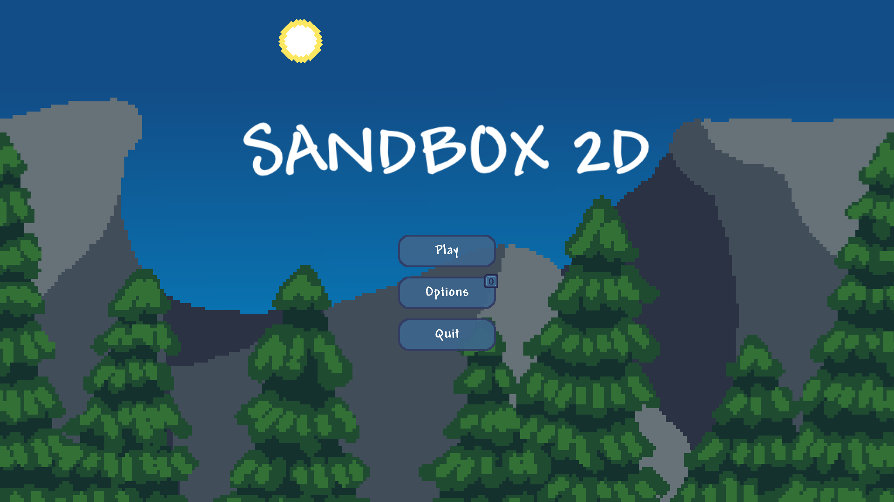
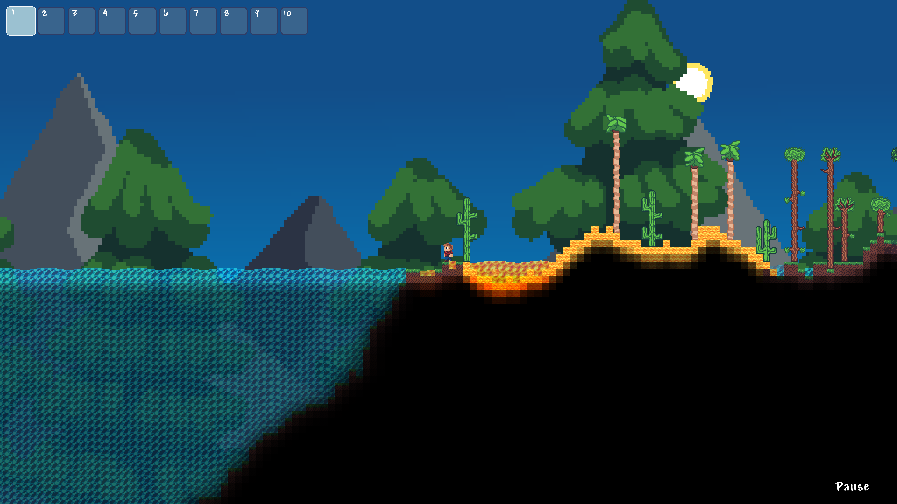

# Sandbox-2D
Build whatever your heart desires, survive the environment or simply play around - it's up to you. Sandbox-2D is a sandbox survival game where you can build, destroy and explore. Ready for the laid-back experience? Download it now for free on [Itch.io](https://acerxamj.itch.io/sandbox-2d).



## Table of Contents
- [Features](#features)
- [Controls](#controls)
- [Installation](#installation)
- [Usage](#usage)
- [Contributing](#contributing)
- [Credits](#credits)

## Features

The game is a WIP, so stay tuned for new features! Currently it includes;
- Building and destroying.
- Water, lava and sand physics.
- Player controller.
- World generation with multiple biomes.
- Lighting system.
- Survival mode.



## Controls

- A, D - move left/right
- SPACE - jump

- LEFT CLICK - place blocks
- RIGHT CLICK - destroy blocks
- MIDDLE CLICK - select a block

- E - Toggle inventory
- ESC - Toggle pause screen
- MINUS - zoom in
- EQUAL - zoom out

## Installation
This project only depends on Raylib 5.5 and it uses C++ standard 17.

#### Prerequisites
You must have git, cmake, a C++ compiler and raylib installed. On Unix you must install Raylib through apt/homebrew or a different package manager (or edit the CMake). On Windows you must install Raylib through [Github Releases](https://github.com/raysan5/raylib/releases) and place all header files in lib folder and all raylib.dll and raylibdll.lib in the project directory.

#### Installation
1. Clone the repository:
```bash
git clone https://github.com/Acerx-AMJ/Sandbox-2D.git
```
2. Navigate in the repository:
```bash
cd Sandbox-2D
```
3. Build using CMake:
```bash
cmake -B build
cmake --build build
```
The executable will be found in `build/sandbox`. If something didn't work, feel free to open an issue.

## Usage

Simply run the executable after [building](#installation). Assets folder must be in the same directory in which the executable is ran.

## Contributing

Feel free to fork and create PRs or issues. Please read [contribution guidelines](CONTRIBUTING.md) before doing so.
1. Fork the repository.
2. Create a new branch (don't use the braces):
```bash
git checkout -b [feature-name]
```
3. Make your changes.
4. Commit and push your changes:
```bash
git add . # Or, alternatively, select specific files to add
git commit -m "[commit-message]"
git push origin [feature-name]
```
5. Create a pull request.

## Credits
This project owes its success to the following people and organizations:

### Contributors
- The code was written by and sprites were made by Acerx-AMJ.
- Windows builds were made by Jhyde927.
- SFX by DTChords.

### Assets
- Thanks to Steve Matteson for creating the "Andy" font!
- Thanks to Google for creating the "Roboto" font!

### Third-party Libraries
- [Raylib](https://www.raylib.com/), which is used in everything from rendering to playing sounds.
- [siv::PerlinNoise](https://github.com/Reputeless/PerlinNoise), which is used to generate worlds.

### License
This project is licensed under the [MIT License](LICENSE). Feel free to copy, edit and distribute the code.
